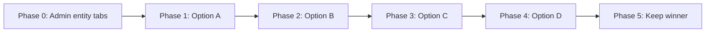

# Sharper entity colors — sequential trial

## Final state (shipped)

- **Palette:** Option C signal chrome (full-chroma borders/icons/spines) for user transport/freight/warehouse + admin vehicles/warehouses.
- **Admin users:** emerald `#059669` / `#34d399` with **softer** per-entity overrides in `.entity-context--users` (distinct from vehicles blue and warehouses purple; not error red).
- **Admin hub tabs:** default `accentMode="entity"` — colored active pills like user hubs.
- **Source:** `src/styles/_entity-service-accent.scss`; docs in `entity-service-colors.mdc`, `entity-tabs.mdc`, `AGENTS.md`.

---

## Goal

Try **Options A → B → C → D** one at a time in the browser. After reviewing all four, pick the winner and keep only that state (revert the others).

**Scope (confirmed):** sharper entity chrome **everywhere** — hub tabs, table spine, create menu, form/detail page title icons (user + admin).

---

## Trial workflow



| Phase | What changes | You review |
|-------|----------------|------------|
| **0** | Enable admin hub tab coloring (one-time) | `/admin/home` tabs tint per entity |
| **1 — A** | Intensity bump only (same hex bases) | All entity chrome slightly sharper |
| **2 — B** | Replace A with saturated bases + A ratios | Dark mode freight/warehouse much clearer |
| **3 — C** | Replace B with signal palette + pure icon/border | Boldest; table spines very visible |
| **4 — D** | Replace C with intensity mixin + preset `sharp` (B-equivalent default) | Same as B visually; adds tunable knob |
| **5** | You pick A, B, C, or D → final SCSS + docs | — |

**Between phases:** each option **fully replaces** the previous token values in [`src/styles/_entity-service-accent.scss`](src/styles/_entity-service-accent.scss). No stacking. Optional: one git commit per phase so you can `git diff` or rewind.

**Phase 0 is permanent** — admin tabs stay on `accentMode="entity"` regardless of which color option wins.

---

## Review checklist (use for every phase)

Light + dark theme; user and admin portals.

| Surface | Route / location |
|---------|------------------|
| Hub tabs (active pill) | `/home`, `/our-listings`, `/admin/home` — all 3 tabs each |
| Table split-card spine | Same hubs — controls + data cards |
| Create menu | Topbar `+` — user (3 options) + admin (3 options) |
| Page title icon | e.g. `/transport/create`, `/admin/vehicles/create` |
| Status badges | Hub table row — still workflow green/amber, not entity orange |

---

## Option definitions (reference)

### Option A — Intensity bump (same palette)

**Bases:** unchanged from today.

**Mixin ratios** (`entity-context-tokens`):

| Token | Today → A |
|-------|-----------|
| `--entity-accent-border` | 40% → **60%** |
| `--entity-accent-icon` | 65% → **85%** (+ transport/users/vehicles spine overrides → **90%**) |
| `--entity-accent-active-bg` | 8% → **14%** |
| `--entity-accent-hover-bg` | 5% → **10%** |
| `--entity-accent-spine` | 30% → **50%** (overrides 42% → **55%**) |
| `--entity-accent-spine-strong` | 55% → **75%** (overrides 62% → **80%**) |
| `--entity-accent-row-hover` | 4% → **8%** |

**Dark bases fix (freight/warehouse only):** `#fed7aa` → `#fb923c`, `#f0abfc` → `#e879f9`.

---

### Option B — Saturated palette + Option A ratios

**Light bases:**

| Entity | Hex |
|--------|-----|
| Transport / Vehicles | `#0369a1` |
| Freight | `#c2410c` |
| Warehouse / Warehouses | `#86198f` |
| Users | `#0f766e` |

**Dark bases:**

| Entity | Hex |
|--------|-----|
| Transport / Vehicles | `#0ea5e9` |
| Freight | `#f97316` |
| Warehouse / Warehouses | `#d946ef` |
| Users | `#14b8a6` |

**Ratios:** same as Option A.

---

### Option C — Signal palette (boldest)

**Light / dark bases:**

| Entity | Light | Dark |
|--------|-------|------|
| Transport / Vehicles | `#0077d4` | `#38bdf8` |
| Freight | `#e85d04` | `#fb923c` |
| Warehouse / Warehouses | `#9333ea` | `#e879f9` |
| Users | `#0d9488` | `#2dd4bf` |

**Asymmetric tokens (override mixin defaults):**

| Token | Value |
|-------|-------|
| `--entity-accent-border` | `var(--entity-accent)` (100%) |
| `--entity-accent-icon` | `var(--entity-accent)` |
| `--entity-accent-active-bg` | 18% base |
| `--entity-accent-spine` | 70% base |
| `--entity-accent-spine-strong` | `var(--entity-accent)` |
| Hover/row mixes | same as Option A |

Tab label text stays `--text-primary`; only border, fill, icon, spine go loud.

---

### Option D — Intensity system (flexible; ships at “B” level)

Refactor `entity-context-tokens` to accept intensity steps. Map presets:

| Preset | Equivalent |
|--------|------------|
| `0` | Today (pre-change) |
| `1` | Option B |
| `1.5` | Option C |

**Implementation:** SCSS maps or CSS custom properties on `:root`:

```scss
--entity-chrome-intensity: 1; // trial: change to 0 | 1 | 1.5 in devtools
```

Default at ship time for trial phase 4: `1` (looks like B). Option A is **not** a separate preset in D — it’s “today bases + intensity 1 ratios” and is covered by reviewing A before B.

After you pick a winner:
- If **A, B, or C** → flatten to static hex + ratios (no intensity knob in production).
- If **D** → keep intensity system; document default in `entity-service-colors.mdc`.

---

## Files touched

| File | Phases |
|------|--------|
| [`src/app/portal/admin/features/home/admin-home-page.component.html`](src/app/portal/admin/features/home/admin-home-page.component.html) | 0 only — remove `accentMode="neutral"` |
| [`src/styles/_entity-service-accent.scss`](src/styles/_entity-service-accent.scss) | 1–4 — each option replaces previous |
| [`.cursor/rules/entity-tabs.mdc`](.cursor/rules/entity-tabs.mdc), [`entity-service-colors.mdc`](.cursor/rules/entity-service-colors.mdc), [`layout.mdc`](.cursor/rules/layout.mdc), [`tables.mdc`](.cursor/rules/tables.mdc), [`AGENTS.md`](AGENTS.md) | **5 only** — after final pick |

No TS changes. `entityContextClass()` already supports admin tabs.

---

## Execution protocol (agent)

1. **Phase 0** → tell user to review → wait for “continue” or “next”.
2. **Phase 1 (A)** → implement → `npm run build` → user reviews.
3. **Phase 2 (B)** → replace A → build → user reviews.
4. **Phase 3 (C)** → replace B → build → user reviews.
5. **Phase 4 (D)** → replace C with intensity system at preset 1 → build → user reviews.
6. **Phase 5** — user announces pick (e.g. “keep B”) → set final SCSS, remove trial scaffolding if any, update docs, final build.

**Do not** update cursor rules until Phase 5.

---

## Todos

- [x] Phase 0: Enable admin entity tabs
- [x] Phase 1: Implement Option A — user review
- [x] Phase 2: Implement Option B — user review
- [x] Phase 3: Implement Option C — user review
- [x] Phase 4: Implement Option D — user review
- [x] Phase 5: Final — Option C signal palette + admin users emerald (softer chrome); docs updated
