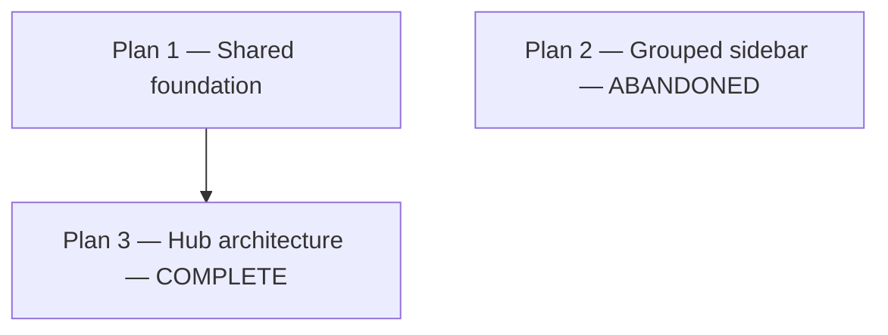
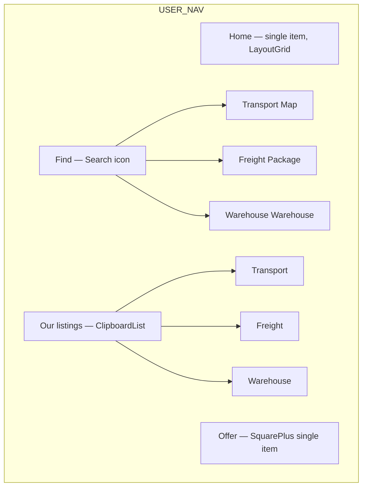

# User portal UX refactor — Plan 1 (shared) + Plan 2 (abandoned) + Plan 3 (complete)

## Dependency graph



Implement **Plan 1 first**, then **Plan 3**. **Plan 2 was abandoned** — topbar-only IA chosen over grouped sidebar.

---

## Unified UX vocabulary (all plans)

| Layer | EN | BH |
|-------|----|----|
| Sidebar: browse | **Find** | **Pronađi** |
| Sidebar: company posts | **Our listings** | **Naše objave** |
| Sidebar: create entry | **Offer** | **Ponudi** |
| Entity tabs / nav items | **Transport · Freight · Warehouse** | **Prevoz · Teret · Skladište** |
| Form submit | Publish transport / freight / warehouse | Objavi prevoz / teret / skladište |
| Picker page title | Offer a listing | Ponudite objavu |

**Icons (Lucide):** Home `LayoutGrid`, Find section `Search`, Our listings `ClipboardList`, Offer `SquarePlus`, entities `Map` / `Package` / `Warehouse`.

**Naming note:** User marketplace entity `Warehouse` (listing) lives in `features/warehouse/`; admin CRUD stays `features/warehouses/` + `CompanyWarehouse` (portal data picker). No admin changes.

**No legacy routes:** Do not register redirects or fallbacks for old paths (`/dashboard`, `/routes`, `/cargo`, `/storage`, `*/mine`). Only new URL constants exist in code. Broken bookmarks to old paths are acceptable.

---

# Plan 1 — Shared foundation (required for Plan 2 and Plan 3)

## 1.1 URL and constant renames

Update [`src/app/shared/constants/user-urls.ts`](src/app/shared/constants/user-urls.ts) and barrel [`app-urls.ts`](src/app/shared/constants/app-urls.ts):

| Old constant | New constant | Path |
|--------------|--------------|------|
| `USER_HOME_URL` | `USER_HOME_URL` | `/home` (was `/dashboard`) |
| `USER_ROUTES_URL` | `USER_TRANSPORT_URL` | `/transport` |
| `USER_MY_ROUTES_URL` | `USER_OUR_TRANSPORT_URL` | `/transport/our` |
| `USER_CREATE_ROUTE_URL` | `USER_CREATE_TRANSPORT_URL` | `/transport/create` |
| `userEditRouteUrl()` | `userEditTransportUrl()` | `/transport/{id}/edit` |
| `USER_CARGO_URL` | `USER_FREIGHT_URL` | `/freight` |
| `USER_MY_CARGO_URL` | `USER_OUR_FREIGHT_URL` | `/freight/our` |
| `USER_CREATE_CARGO_URL` | `USER_CREATE_FREIGHT_URL` | `/freight/create` |
| `userEditCargoUrl()` | `userEditFreightUrl()` | `/freight/{id}/edit` |
| `USER_STORAGE_URL` | `USER_WAREHOUSE_URL` | `/warehouse` |
| `USER_MY_STORAGE_URL` | `USER_OUR_WAREHOUSE_URL` | `/warehouse/our` |
| `USER_CREATE_STORAGE_URL` | `USER_CREATE_WAREHOUSE_URL` | `/warehouse/create` |
| `userEditStorageUrl()` | `userEditWarehouseUrl()` | `/warehouse/{id}/edit` |
| *(new)* | `USER_OFFER_URL` | `/offer` |

**Route registration** in [`user.routes.ts`](src/app/portal/user/user.routes.ts) — Plan 1 baseline (Plan 2 uses this; Plan 3 replaces list routes in section 3.5):
- Default redirect: `''` → `home`
- Remove `dashboard` route entirely — **no redirect** from `/dashboard`
- Delete all old path segments: `routes`, `cargo`, `storage`, `mine`
- Register `*/our` and `*/create` **before** bare entity path and `:id/edit` (same ordering rule as today)
- Plan 1 registers: `home`, `offer`, entity list pages (`transport`, `freight`, `warehouse`, `*/our`), create/edit per entity

**API stub paths** in feature `*.constants.ts`:
- `/api/user/routes` → `/api/user/transport`
- `/api/user/cargo` → `/api/user/freight`
- `/api/user/storage` → `/api/user/warehouse`

## 1.2 Feature folder and file renames

Rename directories and files (git mv). Pattern for each entity:

### Transport (was routes)

| Old | New |
|-----|-----|
| `features/routes/` | `features/transport/` |
| `route.model.ts` → `Route` | `transport.model.ts` → `Transport` |
| `UserRouteService`, `listMine()` | `UserTransportService`, `listOurs()` |
| `route-all.table.ts` / `RouteAllTable` | `transport-all.table.ts` / `TransportAllTable` |
| `table-my/` | `table-our/` |
| `route-my.table.ts` / `RouteMyTable` | `transport-our.table.ts` / `TransportOurTable` |
| `RouteFormPageComponent` / `app-route-form-page` | `TransportFormPageComponent` / `app-transport-form-page` |
| `RouteAllTablePageComponent` | `TransportAllTablePageComponent` |
| `RouteMyTablePageComponent` | `TransportOurTablePageComponent` |
| `route.detail.ts` / `open-route-detail-modal.ts` | `transport.detail.ts` / `open-transport-detail-modal.ts` |
| `route-table-filters.ts`, `ROUTE_*_FILTER_STORAGE_KEY` | `transport-table-filters.ts`, `TRANSPORT_*_FILTER_STORAGE_KEY` (`.mine` → `.our` in localStorage keys) |

### Freight (was cargo)

| Old | New |
|-----|-----|
| `features/cargo/` | `features/freight/` |
| `Cargo` / `CargoType` | `Freight` / `FreightType` |
| `UserCargoService` | `UserFreightService` |
| `CargoSizeDisplayComponent` / `app-cargo-size-display` | `FreightSizeDisplayComponent` / `app-freight-size-display` |
| Same `table-my` → `table-our`, `listMine` → `listOurs`, filter key renames |

### Warehouse (was storage)

| Old | New |
|-----|-----|
| `features/storage/` | `features/warehouse/` |
| `Storage` | `Warehouse` (marketplace listing entity) |
| `UserStorageService` | `UserWarehouseService` |
| Same `table-my` → `table-our`, `listMine` → `listOurs`, filter key renames |

**Cross-feature updates:**
- [`user-dashboard.service.ts`](src/app/portal/user/features/dashboard/data/user-dashboard.service.ts): import renamed services, call `listOurs()`
- [`route.service.ts`](src/app/portal/user/features/transport/data/transport.service.ts) (was routes): keep `CompanyVehicleService` import
- [`warehouse` form](src/app/portal/user/features/warehouse/form/): keep `CompanyWarehouseService` import

**Shared UI — keep unchanged (geographic/domain widgets):**
- `RouteDisplayComponent`, `VehicleDisplayComponent`, `WarehouseDisplayComponent`, `StatusBadgeComponent`, `DateRangeDisplayComponent` — only update import paths in feature table pages

## 1.3 Page icons

Update [`user-page-icons.ts`](src/app/portal/user/user-page-icons.ts):

```typescript
export const UserPageIcons = {
  home: LucideLayoutGrid,
  find: LucideSearch,
  ourListings: LucideClipboardList,
  offer: LucideSquarePlus,
  transport: LucideMap,
  freight: LucidePackage,
  warehouse: LucideWarehouse,
} as const;
```

Replace all `UserPageIcons.routes|cargo|storage|dashboard` references in feature pages and configs.

## 1.4 Home journey page (replaces dashboard)

**Folder:** rename `features/dashboard/` → `features/home/` (or keep folder, rename component — prefer `features/home/` for clarity).

| File | Role |
|------|------|
| `home-page.component.*` | Journey hub UI (4 scenario cards, company snapshot strip, footer browse links) |
| `data/home.service.ts` | Counts via `listOurs()` on three services (rename from dashboard service) |
| Remove `home.actions.config.ts` | Quick-action grid removed — replaced by journey cards |

**Remove:** metrics KPI grid + 3×3 quick-action columns from template.

**Journey card targets after Plan 1 (Plan 2 URLs until Plan 3 rewires home):**
- Find transport → `USER_TRANSPORT_URL` (`/transport`)
- Find freight → `USER_FREIGHT_URL`
- Find warehouse → `USER_WAREHOUSE_URL`
- Offer transport / freight / warehouse → respective `USER_CREATE_*_URL` or `USER_OFFER_URL`
- Snapshot CTA → `USER_OUR_TRANSPORT_URL`
- Footer browse links → `USER_*_URL` marketplace paths

Plan 3 replaces these targets with `userFindUrl()` / `userOurListingsUrl()` (see section 3.6).

Update [`user-portal.config.ts`](src/app/portal/user/user-portal.config.ts) `homeUrl` → `USER_HOME_URL` (`/home`).

## 1.5 Offer picker page (shared)

New feature: `features/offer/`

| File | Role |
|------|------|
| `offer-page.component.*` | Three entity cards (Transport / Freight / Warehouse icons), Continue → create URLs |
| Route in `user.routes.ts` | `path: 'offer'` → `OfferPageComponent` |

No dismissible hints on Find (Plan 3). Picker uses `UserPageIcons.transport|freight|warehouse` on cards and `UserPageIcons.offer` on page title.

## 1.6 i18n overhaul

Restructure [`public/assets/en.json`](public/assets/en.json) and [`bh.json`](public/assets/bh.json) under `portal.user`:

**Nav keys (new):**
- `nav.home`, `nav.find`, `nav.ourListings`, `nav.offer`
- `nav.transport`, `nav.freight`, `nav.warehouse` (entity items under Find / Our listings)
- `nav.sections.find`, `nav.sections.ourListings`

**Pages keys (rename + rephrase):**
- `pages.home.*` (was dashboard)
- `pages.offer.*` (picker)
- Per entity: `pages.marketplaceTransport`, `pages.ourTransport`, `pages.createTransport`, `pages.editTransport` (same pattern for freight, warehouse)
- Remove obsolete keys entirely (do not leave aliases): `myRoutes`, `allRoutes`, `postRoute`, `dashboard`, section keys `routes/cargo/storage`, quickActions

**Defer to Plan 3 i18n:** `pages.find.*`, `pages.ourListings.*`, `features.entityTabs.*`

**Features namespaces:**
- `portal.user.features.routes.*` → `features.transport.*`
- `features.cargo.*` → `features.freight.*`
- `features.storage.*` → `features.warehouse.*`
- `features.home.*` (journey cards, snapshot)
- `features.offer.*` (picker card copy)

**Defer to Plan 3 i18n:** `features.entityTabs.*`

**Form back links:** `nav.ourTransport`, `nav.ourFreight`, `nav.ourWarehouse` (replace `my*` keys).

Update every TS `titleKey`, `labelKey`, `pageTitleKey`, `backLabelKey` string across feature pages.

## 1.7 Docs and rules (Plan 1 only)

Update references — remove all mentions of old paths, folder names, and constants (`routes`, `cargo`, `storage`, `mine`, `dashboard`, `listMine`, `table-my`, `USER_MY_*`, `USER_ROUTES_URL`, etc.):

| File | Plan 1 updates |
|------|------------------|
| [`AGENTS.md`](AGENTS.md) | User feature paths (`transport`, `freight`, `warehouse`), URL constants, `table-our/`, `listOurs()`, Home + Offer pages, `UserPageIcons` keys |
| [`app-urls.mdc`](.cursor/rules/app-urls.mdc) | Full `user-urls.ts` export list (`USER_TRANSPORT_URL`, `USER_OUR_*`, `USER_OFFER_URL`, `/home`) |
| [`portal-feature.mdc`](.cursor/rules/portal-feature.mdc) | Feature folders, `*/our` route order, service names, back-link keys (`nav.our*`) |
| [`00-project.mdc`](.cursor/rules/00-project.mdc) | Feature list, references, quick-entry paths |
| [`tables.mdc`](.cursor/rules/tables.mdc) | `table-all/` / `table-our/` examples, entity display widgets per feature |
| [`table-filters.mdc`](.cursor/rules/table-filters.mdc) | Filter def paths (`transport-table-filters.ts`, etc.) |
| [`i18n.mdc`](.cursor/rules/i18n.mdc) | `portal.user.features.{transport,freight,warehouse,home,offer}` namespaces |
| [`shared-constants.mdc`](.cursor/rules/shared-constants.mdc) | `UserPageIcons` keys (`transport`, `freight`, `warehouse`, `home`, `find`, `ourListings`, `offer`) |
| [`entity-status.mdc`](.cursor/rules/entity-status.mdc) | Feature table page paths |
| [`page-title.mdc`](.cursor/rules/page-title.mdc) | Back-link keys (`nav.ourTransport`, etc.) |
| [`new-page.mdc`](.cursor/rules/new-page.mdc) | User CRUD examples, dashboard → home |
| [`forms.mdc`](.cursor/rules/forms.mdc) | Feature form paths if referenced |
| [`detail-modal.mdc`](.cursor/rules/detail-modal.mdc) | Detail modal paths per entity |

**Defer to Plan 2:** `layout.mdc` NavItem icon policy (still documents text-only items after Plan 1).

**Defer to Plan 3:** Tab hub patterns in `portal-feature.mdc`, `new-page.mdc`, optional new `entity-tabs.mdc`.

## 1.8 Verification

- `npm run build`
- Manual: `/home`, `/offer`, `/transport`, `/transport/our`, create/edit flows, filter persistence with new storage keys

---

# Plan 2 — Grouped sidebar — **ABANDONED**

**Status:** Cancelled. Topbar-only shell with marketplace/my-listings hubs (Plan 3) was chosen instead of grouped sidebar nav.

The spec below is retained for historical context only — do not implement.

## 2.1 NavItem icon support

Extend [`nav.model.ts`](src/app/portal/common/models/nav.model.ts):

```typescript
export interface NavItem {
  labelKey: string;
  route: string;
  exact?: boolean;
  icon?: LucideIcon;
}
```

Update templates:
- [`portal-sidebar.component.html`](src/app/portal/shell/portal-sidebar/portal-sidebar.component.html)
- [`sidebar-section-flyout.component.html`](src/app/portal/shell/portal-sidebar/sidebar-section-flyout/sidebar-section-flyout.component.html)

Add SCSS in [`_sidebar-nav-panel.scss`](src/app/portal/shell/portal-sidebar/_sidebar-nav-panel.scss): icon size (~16px), gap, alignment with rail.

## 2.2 New `USER_NAV` structure

Replace [`user-nav.config.ts`](src/app/portal/user/user-nav.config.ts):



| Section | `titleKey` | Section icon | Items |
|---------|------------|--------------|-------|
| Home | `nav.sections.home` | `UserPageIcons.home` | Home → `/home` |
| Find | `nav.sections.find` | `UserPageIcons.find` | Transport → `/transport`, Freight → `/freight`, Warehouse → `/warehouse` (each with entity icon) |
| Our listings | `nav.sections.ourListings` | `UserPageIcons.ourListings` | Transport → `/transport/our`, Freight → `/freight/our`, Warehouse → `/warehouse/our` |
| Offer | *(single-item section)* | `UserPageIcons.offer` | Offer → `/offer` |

**Collapsed sidebar:** Home and Offer as rail links; Find and Our listings as flyout triggers (section icon on rail, item icons inside panel).

## 2.3 List page copy tweaks (no structural change)

Update page `titleKey` / `subtitleKey` on existing all/our table pages to marketplace/our-listings copy from Plan 1 i18n (e.g. “Transport on the marketplace”, “Our freight”).

Optional muted cross-link in template footer (not banner): on marketplace pages link to Our listings; on our pages link to Find.

**Create CTAs:** Remove `PrimaryActionLink` from our-table pages header if Offer is the canonical create entry — **or** keep per-tab “Offer transport” on our-table pages (recommended for convenience). Marketplace (all) pages: no create CTA in header.

## 2.4 Cursor rules (Plan 2 only)

| File | Plan 2 updates |
|------|----------------|
| [`layout.mdc`](.cursor/rules/layout.mdc) | `NavItem.icon?`; render icons in expanded sidebar + flyout; item icon size/gap SCSS; grouped user nav structure (Home, Find, Our listings, Offer); **remove** “text-only NavItem” rule |
| [`shared-constants.mdc`](.cursor/rules/shared-constants.mdc) | Nav item icon assignment (`UserPageIcons.transport` on Find → Transport link, etc.) |
| [`new-page.mdc`](.cursor/rules/new-page.mdc) | User nav section example matching Plan 2 `USER_NAV` |
| [`AGENTS.md`](AGENTS.md) | Sidebar nav description (4 sections, entity item icons) |

## 2.5 Verification

- Sidebar expanded/collapsed/mobile drawer
- All 7 list routes + Offer + Home reachable
- Active state: `isNavSectionActive` works for Find vs Our listings when on entity pages
- No references to old nav section keys (`routes`, `cargo`, `storage`, `dashboard`) in configs or rules

---

# Plan 3 — Hub architecture (complete)

**Status:** **Complete** (user + admin portals). **Plan 2 cancelled** — topbar-only shell chosen over sidebar intent nav.

**Prerequisite:** Plan 1 entity rename complete.

## What shipped (user portal)

Topbar-only IA — no sidebar, no `/find`, no `/offer` route (create via `EntityCreateMenuComponent` dropdown):

| Surface | Route | EN | BH | Icon |
|---------|-------|----|----|------|
| Marketplace hub | `/home?tab=` | Marketplace | Tržište | `UserPageIcons.marketplace` |
| My listings hub | `/our-listings?tab=` | My listings | Moje objave | `UserPageIcons.ourListings` |
| Publish | topbar `+` (`EntityCreateMenuComponent`) | — | — | — |
| Account | Moje objave → `/our-listings` | My listings | Moje objave | `LucideListChecks` |

### Components and routes

- **`EntityTabsComponent`** — `shared/ui/entity-tabs/`; `accentMode: 'entity'` on user hubs; sticky tabs; mobile horizontal scroll.
- **Hub pages:** `features/home/` (marketplace), `features/our-listings/` (my listings) — `.page-hub-header` + tab-specific publish CTA + muted cross-link + embedded tables.
- **Hub-only list routes** in `user.routes.ts` — no standalone `/transport`, `/freight`, `/warehouse`, or `*/our` list pages.
- **Embedded table pages** — `table-all/` and `table-our/` render `DataTableComponent` only (no standalone page chrome).
- **URL builders:** `userMarketplaceUrl()` / `userMarketplaceRoute()` (marketplace), `userOurListingsUrl()` / `userOurListingsRoute()` (my listings).
- **Table defs:** feature-root `transport.table.ts` / `freight.table.ts` / `warehouse.table.ts` with `build*Table('all' | 'our')` factories; filter storage keys use `.our` suffix.
- **Hub tab sync:** `syncHubEntityTab()` in `shared/utils/hub-tab-sync.ts`.
- **Detail actions:** `buildDetailPageActions(portal, entity, options)`; `EntityDetailOrigin = 'marketplace' | 'our'`.
- **Detail back links:** `MARKETPLACE_BACK_LABEL_KEY` / `OUR_LISTINGS_BACK_LABEL_KEY` via `entity-detail-navigation.ts`.
- **Cross-links:** `pages.home.crossLink` ↔ `pages.ourListings.crossLink` below entity tabs.
- **Empty state CTA:** `*OurTablePage` passes `emptyActionRoute` + `emptyActionLabelKey` to `DataTableComponent`.

### Deferred / out of scope

- Sidebar intent nav (Home / Find / Our listings / Offer)
- `/find` route (marketplace lives at `/home`)
- `/offer` picker page — replaced by topbar `EntityCreateMenuComponent` (`shared.topbar.offer.openMenu`)
- Home journey / marketing dashboard
- Mobile bottom nav

## What shipped (admin portal)

Mirrors single-home + tabs pattern (company-scoped CRUD only):

| Surface | Route | Notes |
|---------|-------|-------|
| Admin home hub | `/admin/home?tab=` | Users \| Vehicles \| Warehouses tabs |
| Create | topbar `+` (`EntityCreateMenuComponent`) | → `ADMIN_CREATE_*_URL` (`shared.topbar.create.openMenu`) |
| Account | Settings + Logout only | **No** Moje objave |
| Row click | → edit form | `adminEdit*Url(id)` — no detail pages |

- **`ADMIN_HOME_URL`** = `/admin/home`; `adminHomeUrl(tab?)`.
- **Removed:** dashboard, standalone `/admin/users|vehicles|warehouses` list routes.
- **Kept:** create/edit per entity, settings.
- **Entity tabs:** admin hub uses default `accentMode="entity"` (colored pills, same as user hubs); signal palette in `_entity-service-accent.scss`.
- **Forms:** back link + post-save redirect → `adminHomeUrl(matchingTab)`.

## Cursor rules updated

| File | Updates |
|------|---------|
| `entity-tabs.mdc` | User hub pattern, `userMarketplaceUrl`, cross-links, embedded tables |
| `app-urls.mdc` | `userMarketplaceUrl` / `userMarketplaceRoute`, `adminHomeUrl` |
| `portal-feature.mdc` | User + admin hub patterns |
| `layout.mdc` | Topbar account menu per portal |
| `AGENTS.md` | Hub architecture reference |

## Verification

- User: `/home` + `/our-listings` tabs, row click → detail, forms → my listings, topbar navigation.
- Admin: `/admin/home` tabs, row click → edit, create menu, no Moje objave in account menu.
- `npm run build` passes.

---

## Historical Plan 3 spec (superseded)

The sections below described the original sidebar + `/find` design. Implementation diverged as documented above.

## 3.1 Sidebar (4 intents, no entity links) — cancelled

Replace [`user-nav.config.ts`](src/app/portal/user/user-nav.config.ts):

| Item | Icon | Route |
|------|------|-------|
| Home | `home` | `/home` |
| Find | `find` | `/find` |
| Our listings | `ourListings` | `/our-listings` |
| Offer | `offer` | `/offer` |

Single-item sections or flat 4-section config — no entity children in sidebar. **No NavItem icons required** (section icons only), but Plan 2’s NavItem icon work can remain harmless if Plan 2 was not merged.

## 3.2 Shared `EntityTabsComponent`

New shared component: `src/app/shared/ui/entity-tabs/` (or `portal/user/ui/entity-tabs/` if portal-only)

| Input | Type |
|-------|------|
| `activeTab` | `'transport' \| 'freight' \| 'warehouse'` |
| `tabs` | config with labelKey + icon from `UserPageIcons` |

Outputs: `tabChange` event. Sticky below page title. Horizontal scroll on mobile.

i18n: `portal.user.features.entityTabs.transport|freight|warehouse`

## 3.3 Find hub page

New: `features/find/find-page.component.*`

- Title: Find / “Browse listings from other companies…”
- `EntityTabsComponent` bound to route query `?tab=transport|freight|warehouse` (default `transport`)
- Body: embed existing table content by switching `@switch (tab)`:
  - Reuse `TransportAllTable` + loader from `TransportAllTablePageComponent` **or** compose `app-data-table` inline (extract shared loader logic to avoid duplicating full page components)
- **No dismissible hint** when arriving from Home journey cards
- Optional muted footer: “Manage your company’s listings → Our listings”

**Route:** `path: 'find'` in [`user.routes.ts`](src/app/portal/user/user.routes.ts)

## 3.4 Our listings hub page

New: `features/our-listings/our-listings-page.component.*`

- Title: Our listings / company scope subtitle
- Same `EntityTabsComponent` + query param `?tab=`
- Embeds our-table defs (`TransportOurTable`, etc.)
- **Per-tab header CTA:** `PrimaryActionLink` → `USER_CREATE_TRANSPORT_URL` / freight / warehouse (changes with active tab)
- Empty states per tab with Offer CTA

**Route:** `path: 'our-listings'`

## 3.5 URL strategy — hub routes only (no standalone list pages)

Add to [`user-urls.ts`](src/app/shared/constants/user-urls.ts):

| Constant | Path |
|----------|------|
| `USER_FIND_URL` | `/find` |
| `USER_OUR_LISTINGS_URL` | `/our-listings` |
| `userFindUrl(tab?)` | `/find?tab=transport` (etc.) |
| `userOurListingsUrl(tab?)` | `/our-listings?tab=transport` (etc.) |

**Remove from `user.routes.ts`** (Plan 3 replaces Plan 1 list routes — do not keep both):
- `transport`, `freight`, `warehouse` (marketplace list)
- `transport/our`, `freight/our`, `warehouse/our` (our list)

**Keep registered** (forms only):
- `transport/create`, `transport/:id/edit` (same for freight, warehouse)
- `home`, `offer`, `find`, `our-listings`

**Remove unused URL constants** from Plan 1 that only served standalone list pages (`USER_TRANSPORT_URL`, `USER_OUR_TRANSPORT_URL`, etc.) — replace all navigation with `USER_FIND_URL` / `USER_OUR_LISTINGS_URL` + tab builders. Create/edit constants unchanged.

**No redirects** from old or Plan-1-style list paths — those routes are not registered at all in Plan 3.

## 3.6 Home journey card targets (Plan 3)

Update [`home-page`](src/app/portal/user/features/home/) navigation when Plan 3 ships:
- Find actions → `userFindUrl('transport' | 'freight' | 'warehouse')`
- Snapshot CTA → `userOurListingsUrl('transport')`
- Footer browse links → `userFindUrl(...)`
- Offer card actions → `USER_OFFER_URL` or direct create URLs (unchanged)

Form back links → `userOurListingsUrl(matchingEntity)` (not `/transport/our`).

## 3.7 Cursor rules (Plan 3 only)

| File | Plan 3 updates |
|------|----------------|
| [`app-urls.mdc`](.cursor/rules/app-urls.mdc) | `USER_FIND_URL`, `USER_OUR_LISTINGS_URL`, tab URL builders; remove standalone list URL exports |
| [`portal-feature.mdc`](.cursor/rules/portal-feature.mdc) | Plan 3 user nav (4 intents); `find/` + `our-listings/` hub folders; list pages only inside hubs; create/edit routes remain per entity |
| [`layout.mdc`](.cursor/rules/layout.mdc) | Intent sidebar (no entity children); optional `EntityTabsComponent` mention |
| [`tables.mdc`](.cursor/rules/tables.mdc) | Table pages composed inside hub pages, not standalone routes |
| [`new-page.mdc`](.cursor/rules/new-page.mdc) | Hub page checklist, `EntityTabsComponent` usage |
| [`i18n.mdc`](.cursor/rules/i18n.mdc) | `pages.find.*`, `pages.ourListings.*`, `features.entityTabs.*` |
| [`AGENTS.md`](AGENTS.md) | Plan 3 nav + hub routes as user portal reference |
| **New:** [`.cursor/rules/entity-tabs.mdc`](.cursor/rules/entity-tabs.mdc) | `EntityTabsComponent` API, tab query param convention, sticky behavior, icons from `UserPageIcons` |

## 3.8 Verification

- Tab switching updates query param and preserves filters per entity (separate `filterStorageKey` unchanged)
- Find hub: no create CTA in header
- Our listings hub: tab-specific Offer CTA works
- Mobile: sticky tabs + bottom nav (optional follow-up: 4-item bottom bar)

---

## Implementation order summary

| Step | Plan | Deliverable |
|------|------|-------------|
| 1 | Plan 1 | Entity rename, URLs, i18n, Home, Offer picker, Plan 1 cursor rules |
| 2a | Plan 2 | NavItem icons + grouped sidebar + Plan 2 cursor rules; keeps standalone list routes (`/transport`, `/transport/our`, …) |
| **or** 2b | Plan 3 | EntityTabs + hub-only list routes (`/find`, `/our-listings`) + Plan 3 cursor rules; removes standalone list routes |

**Estimate:** Plan 1 is the bulk (~59 feature files + i18n). Plan 2 is small (~6 shell files + nav config). Plan 3 is medium (~4 new pages/components + route consolidation + tab URL builders).

**Route surface by plan:**

| Route type | Plan 2 | Plan 3 |
|------------|--------|--------|
| Home | `/home` | `/home` |
| Offer picker | `/offer` | `/offer` |
| Browse lists | `/transport`, `/freight`, `/warehouse` | `/find?tab=` only |
| Our lists | `/transport/our`, … | `/our-listings?tab=` only |
| Create / edit | `/transport/create`, `/transport/:id/edit`, … | same |
| Legacy | none | none |
